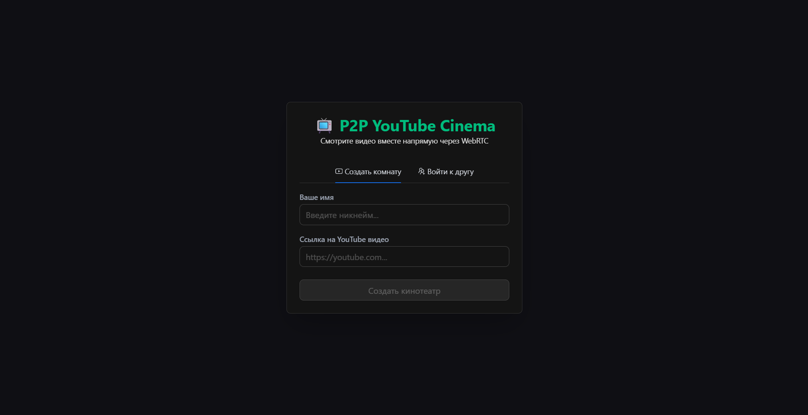
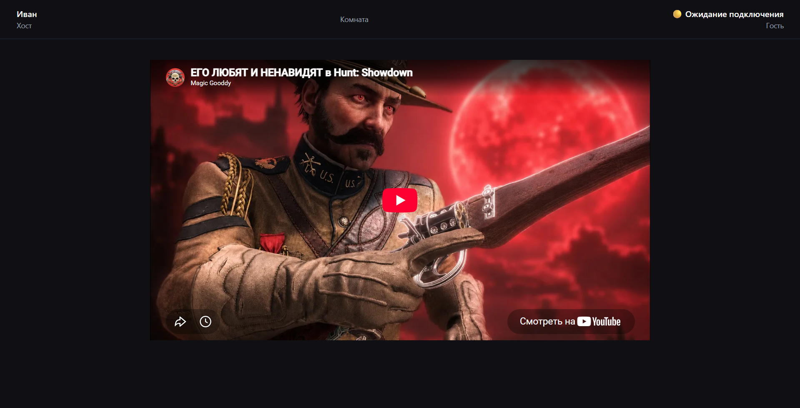

# YouTube Watch Together

> P2P-сервис для совместного просмотра YouTube-видео в реальном времени.

YouTube Watch Together позволяет двум пользователям подключиться к одной комнате и смотреть видео синхронно. Пользователи могут запускать и останавливать воспроизведение, перематывать видео и обмениваться состоянием плеера напрямую, без собственного backend для передачи видеопотока.

## Возможности

- Создание комнаты для совместного просмотра.
- Подключение второго пользователя по идентификатору комнаты.
- Совместное воспроизведение YouTube-видео.
- Синхронизация play, pause и seek.
- Передача текущего времени воспроизведения между участниками.
- Корректировка рассинхронизации при задержках сети.
- Работа через P2P-соединение.

## Технологический стек

- **React** — построение пользовательского интерфейса.
- **TypeScript** — типизация компонентов, событий и состояния.
- **MobX** — управление состоянием приложения.
- **PeerJS** — создание P2P-соединений между пользователями.
- **Vite** — сборка и разработка проекта.
- **Tailwind CSS** — стилизация интерфейса.
- **Ant Design** — готовые UI-компоненты.
- **YouTube IFrame Player API** — управление воспроизведением видео.

## Архитектура

Приложение построено по P2P-модели: пользователи обмениваются командами напрямую, а видеопоток загружается каждым клиентом самостоятельно из YouTube.

```text
User A
  │
  │ P2P connection
  ▼
PeerJS
  ▲
  │ P2P connection
  │
User B

Каждый клиент самостоятельно загружает видео
через YouTube IFrame Player API.
```

## Структура состояния

Состояние приложения разделено на несколько MobX-сторов:

- **UserStore** — имя пользователя, имя друга и роль участника.
- **PlaybackStore** — URL видео, состояние воспроизведения, текущее время и экземпляр YouTube-плеера.
- **P2PStore** — PeerJS-инстанс, соединение, подключение к комнате и обработчики сетевых событий.

Такое разделение позволяет отделить UI-состояние, состояние плеера и сетевую логику.

## Синхронизация воспроизведения

Для синхронизации между участниками передаются команды:

```text
PLAY
PAUSE
SEEK
```

Каждое событие содержит состояние плеера и временную метку. При получении команды клиент учитывает задержку передачи данных и рассчитывает целевое время воспроизведения.

```text
targetTime = remoteTime + networkLatency
```

Это позволяет уменьшить рассинхронизацию при нестабильном или медленном соединении.

Дополнительно приложение периодически сравнивает локальное и удалённое время воспроизведения. Если разница превышает допустимый порог, выполняется корректирующий seek.

## Работа с YouTube Player API

YouTube-плеер управляется через IFrame Player API.

Обрабатываются основные состояния:

- `PLAYING` — видео воспроизводится.
- `PAUSED` — видео поставлено на паузу.
- `BUFFERING` — видео буферизуется.
- `CUED` — видео готово к воспроизведению.

Состояние плеера используется для определения момента, когда участник готов продолжить совместное воспроизведение.

## Технические особенности

- P2P-обмен командами через PeerJS.
- Отсутствие собственного backend для передачи видеопотока.
- Разделение сетевой логики и состояния плеера.
- Синхронизация воспроизведения с учётом сетевой задержки.
- Периодическая проверка рассинхронизации.
- Поддержка YouTube-ссылок разных форматов.
- Управление состоянием через MobX.
- Компонентная архитектура на React и TypeScript.

## Основная идея проекта

YouTube Watch Together решает задачу совместного просмотра видео без необходимости передавать само видео через сервер. Каждый пользователь смотрит контент со своей стороны, а приложение синхронизирует только команды управления и состояние воспроизведения.

## Screenshots

### Страница входа
Вход в приложение и подключение к комнате.



### Комната совместного просмотра
Основной экран для совместного просмотра YouTube-видео.

